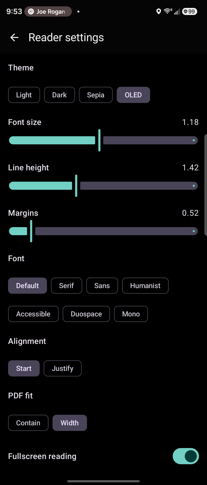

# XReader

XReader is a native Android e-reader focused on a fast, private reading loop for DRM-free personal libraries. It imports books through Android's Storage Access Framework, copies them into app-owned storage, and keeps reading state, notes, bookmarks, search data, dictionary lookup, and analytics local to the device.



## Current Status

This repository is an early personal APK build. The core reader path is real and device-tested, but the app is not packaged for Play Store distribution yet.

Implemented:

- EPUB and PDF reading through Readium Kotlin.
- TXT import converted into a minimal EPUB package so text books use the same reader path.
- Private app-library imports with checksum duplicate detection.
- Library organization by books, authors, series, genres, years, recent, unread, in progress, finished, and favorites.
- Persisted library sort and comfortable/compact density controls.
- Metadata editing for title, author, year, genre, series, series order, and opt-in bulk series/genre cleanup.
- Covers, including EPUB guide/title-page cover references, metadata extraction, manual cover replacement, per-book health checks, and repair/reindex actions.
- Resume from persisted Readium locators with percent read and progress state.
- Swipe, tap-zone, hardware-key, TOC, search-result, bookmark, and scrubber navigation.
- Reader themes: light, dark, sepia, and OLED black.
- Reader typography controls: font size, line height, margins, alignment, publisher styles, PDF fit, fullscreen, page animation toggle, and real Readium/CSS-resolvable font choices.
- Grouped Settings screen for reader appearance, typography, reading behavior, library display, and maintenance.
- Bookmarks, highlights, notes, global notes, in-book annotation lists, local notes/bookmark JSON export/import, and library metadata/progress backup.
- Offline English dictionary backed by bundled Princeton WordNet data.
- Local full-text search index for imported book text where extraction is supported.
- Reading analytics for sessions, active reading time, progress, estimated WPM, 7-day/30-day/13-week/all-time activity, streaks, book/author/genre summaries, and local JSON export.

Not implemented in the UI:

- MOBI/AZW3 conversion.
- DRM handling.
- Cloud sync.
- Ads, subscriptions, or social features.

## Requirements

- macOS, Linux, or Windows with Android SDK tooling.
- JDK 21.
- Android Studio or command-line Android SDK.
- Android device or emulator running API 26 or newer.

The project uses Gradle 9.5.1 wrapper, Android Gradle Plugin 9.2.1, Kotlin 2.3.21, compileSdk 36, and minSdk 26.

## Build

```bash
./gradlew :app:lintDebug :app:testDebugUnitTest :app:assembleDebug --console=plain
```

The debug APK is written to:

```text
app/build/outputs/apk/debug/app-debug.apk
```

Install on a connected device:

```bash
adb install -r app/build/outputs/apk/debug/app-debug.apk
adb shell am start -n com.xreader.app/.MainActivity
```

Release builds are currently unsigned:

```bash
./gradlew :app:lintRelease :app:assembleRelease --console=plain
```

## Dictionary Asset

The bundled dictionary is built from Princeton WordNet 3.0:

```bash
python3 tools/build_wordnet_asset.py
```

This writes:

- `app/src/main/assets/dictionary/wordnet.db`
- `app/src/main/assets/dictionary/LICENSE_WORDNET.txt`

WordNet attribution is included in `NOTICE` and in the bundled license file.

## Privacy

XReader is local-first:

- Books are imported through Android's file picker and copied into app-owned private storage.
- The app does not request broad all-files access.
- The app does not intentionally use network access.
- Reading analytics, notes, bookmarks, dictionary lookup, and search indexes stay local.

## Documentation

- [Architecture](docs/ARCHITECTURE.md)
- [Competitive Research](docs/COMPETITIVE_RESEARCH.md)
- [Performance](docs/PERFORMANCE.md)
- [Roadmap](docs/ROADMAP.md)
- [Contributing](CONTRIBUTING.md)
- [Changelog](CHANGELOG.md)
- [Security](SECURITY.md)
- [Notices](NOTICE)

## License

XReader is licensed under the MIT License. See [LICENSE](LICENSE).
